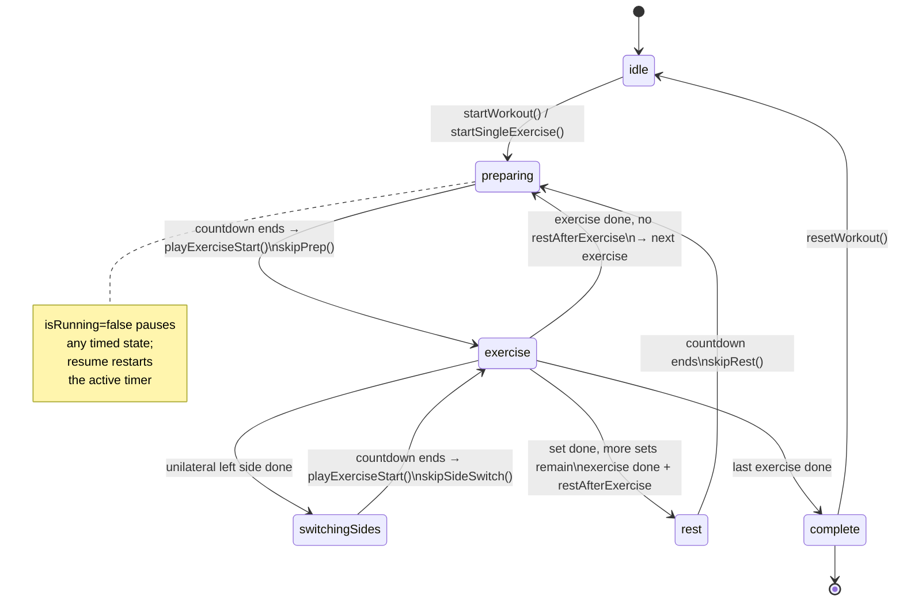

# Workout State Machine

## Transitions

| From | To | Condition |
|---|---|---|
| `idle` | `preparing` | workout started |
| `preparing` | `exercise` | countdown ends (fires `playExerciseStart`) or `skipPrep()` |
| `exercise` | `switchingSides` | unilateral, left side just finished |
| `switchingSides` | `exercise` | 3 s countdown ends (fires `playExerciseStart`) or `skipSideSwitch()` |
| `exercise` | `rest` | set done + more sets remain, **or** exercise done + `restAfterExerciseSeconds` set |
| `rest` | `preparing` | 30 s countdown ends or `skipRest()` |
| `exercise` | `preparing` | exercise done, no rest → next exercise's prep starts |
| `exercise` | `complete` | last exercise's last set done |
| `complete` | `idle` | `resetWorkout()` |

`playExerciseStart` fires on every `preparing → exercise` and `switchingSides → exercise` transition.
Pause/resume (`isRunning` flag) is orthogonal — it freezes any timed state without changing the phase.
